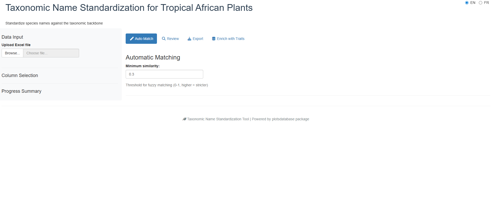
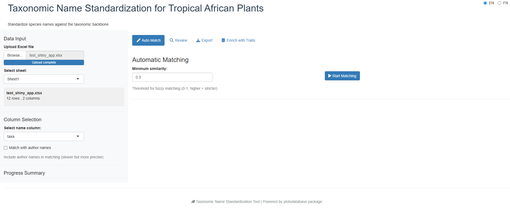
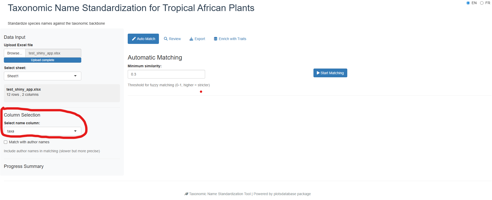
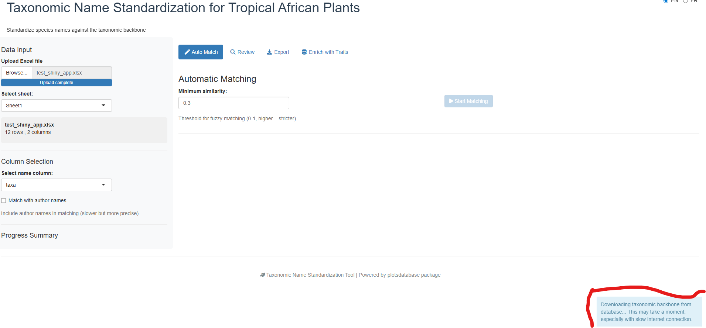
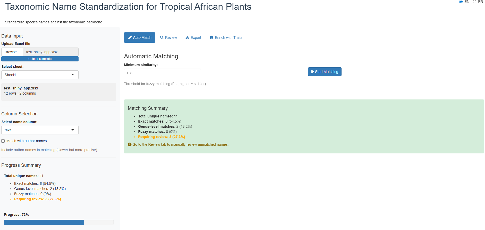
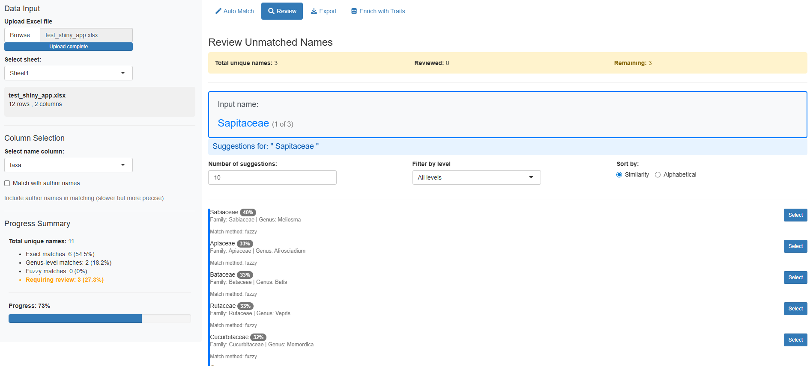
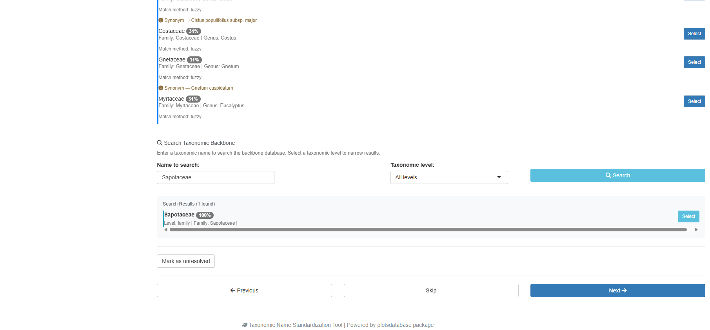
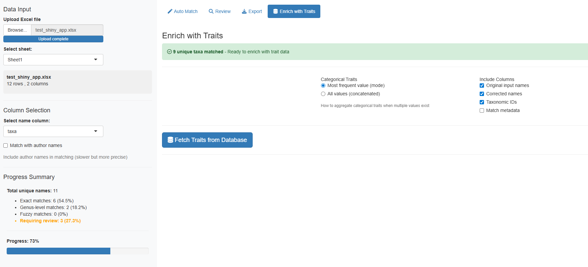
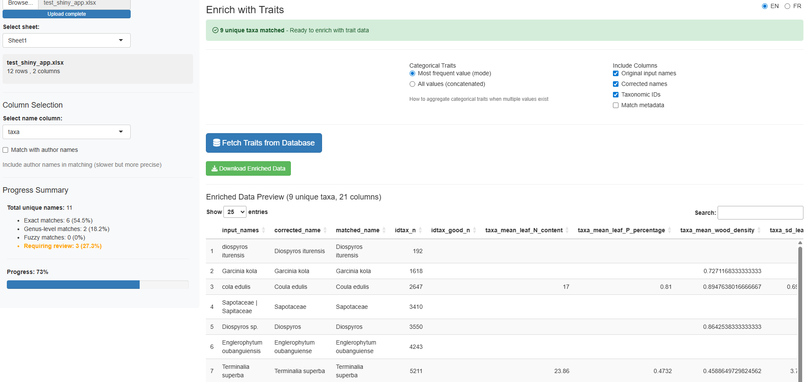

```{r, include = FALSE}
knitr::opts_chunk$set(
  collapse = TRUE,
  comment = "#>",
  eval = FALSE,
  echo = TRUE
)
```

## Introduction

The `launch_taxonomic_match_app()` function provides an interactive Shiny application for standardizing taxonomic names against the Central African plant taxonomic backbone database. This visual interface is ideal for:

- Exploring and cleaning taxonomic data interactively
- Understanding match quality through visual feedback
- Manually reviewing uncertain matches

## Prerequisites

Before launching the app, ensure you have:

1. **Database credentials** configured (see `setup_db_credentials()`)
2. **Data to standardize** in one of these formats:
   - Excel file (.xlsx)
3. A column containing **taxonomic names** (genus + species)

## Quick Start

Launch the app with a single command:

```{r}
library(plotsdatabase)
launch_taxonomic_match_app()
```

Alternatively, pre-load your data:

```{r}
# With R data.frame
my_data <- read.csv("tree_inventory.csv")
launch_taxonomic_match_app(data = my_data, name_column = "species_name")


# Adjust fuzzy matching sensitivity
launch_taxonomic_match_app(min_similarity = 0.7)  # More strict matching
```

## Step-by-Step Walkthrough

### Phase 1: Initial View

When you first launch the app, you'll see the main interface with a sidebar for configuration and tabs for different workflow phases:



The app uses a **tabbed workflow** that guides you through each phase sequentially.

### Phase 2: Upload Your Data

The first step is to provide your data. You can either:

- **Upload an Excel file** using the file browser
- **Use pre-loaded R data** (if you passed `data` parameter)



The app will display a preview of your uploaded data so you can verify it was read correctly.

### Phase 3: Select Name Column

Once data is loaded, select which column contains the taxonomic names to standardize:



The dropdown menu shows all available columns from your dataset. Choose the one containing species names (typically formatted as "Genus species" or "Genus species Author").

### Phase 4: Automatic Matching

Click the **"Start Matching"** button to begin the automatic matching process. The app uses a three-tier matching strategy:

1. **Exact match**: Direct lookup of full name
2. **Genus-constrained fuzzy match**: Searches within matched genera
3. **Full database fuzzy match**: Searches entire backbone (last resort)



The progress bar shows real-time status. For large datasets, this may take a few minutes.

### Phase 5: Review Match Results

After matching completes, you'll see a summary table showing all names with their match status:



The results table includes:

- **Original name**: Your input name
- **matched_name**: Name found in backbone
- **match_method**: How it was matched (exact, genus_constrained, fuzzy, manual)
- **match_score**: Similarity score (0-1, higher is better)
- **idtax_n**: Taxon ID in database
- **is_synonym**: Whether matched name is a synonym
- **accepted_name**: Current accepted name (if synonym)

**Match quality indicators:**

- **Exact match (1.0)**: Perfect match, no review needed
- **High similarity (>0.8)**: Very likely correct, quick review recommended
- **Medium similarity (0.5-0.8)**: Possible match, review suggested
- **Low similarity (<0.5)**: Uncertain, manual review required
- **No match**: Requires manual selection

### Phase 6: Manual Review

For unmatched or uncertain names, switch to the **"Review"** tab to manually review and select matches:



The review interface shows:

- **Current unmatched name** at the top
- **Fuzzy match suggestions** ranked by similarity
- **Taxonomic information** for each suggestion (family, genus, species)
- **Similarity scores** to help assess match quality

You can:

- **Accept a suggestion**: Click the name to select it
- **Skip**: Move to next name without selecting
- **Search manually**: Type to search the backbone database



The app remembers your selections and automatically updates the results table.

### Phase 7: Enrich Data with Traits

Additionally, you can enrich your matched data with taxonomic traits from the backbone database:



Select which traits to add to your dataset, such as:

- Growth form
- Wood density
- Leaf traits
- Ecological characteristics

The enriched data combines your original data with taxonomic information and selected traits:



### Phase 8: Export Results

Once you're satisfied with the matches, export your standardized dataset:


Available export formats:

- **Excel (.xlsx)**: Best for sharing with collaborators
- **CSV (.csv)**: Universal tabular format
- **RDS (.rds)**: R-native format preserving data types

The exported file includes:

- All your original columns
- New columns with taxonomic information (`idtax_n`, `matched_name`, `match_method`, etc.)
- Enriched trait data (if selected)

## Understanding Output Columns

The app adds these columns to your data:

| Column | Description |
|--------|-------------|
| `idtax_n` | Matched taxon ID in backbone database |
| `idtax_good_n` | Accepted taxon ID (for synonyms) |
| `matched_name` | Name found in backbone |
| `corrected_name` | Final standardized name |
| `match_method` | Matching strategy used (exact, genus_constrained, fuzzy, manual) |
| `match_score` | Similarity score (0-1) |
| `is_synonym` | TRUE if matched name is a synonym |
| `accepted_name` | Current accepted name (if synonym) |
| `family` | Taxonomic family |
| `genus` | Taxonomic genus |

## Advanced Options

### Language Selection

Not yet functional...

### Adjusting Fuzzy Matching

Control matching sensitivity with the `min_similarity` parameter:

```{r}
# Very strict - only high-quality matches
launch_taxonomic_match_app(min_similarity = 0.8)

# More permissive - allows lower-quality matches
launch_taxonomic_match_app(min_similarity = 0.3)  # Default
```

Lower values cast a wider net but may include false positives. Higher values are more conservative but may miss valid matches.

### Increasing Suggestions

Show more fuzzy match suggestions per name:

```{r}
# Show top 20 suggestions instead of default 10
launch_taxonomic_match_app(max_suggestions = 20)
```

Useful when initial suggestions don't include the correct match.

## Troubleshooting

### Connection Issues

**Problem**: "Failed to connect to database"

**Solution**:
```{r}
# Check connection
db_diagnostic()

# Reset credentials if needed
remove_db_credentials()
setup_db_credentials()
```

### No Fuzzy Matches Found

**Problem**: No suggestions appear for unmatched names

**Possible causes**:
- `min_similarity` threshold too high
- Taxonomic names contain typos or non-standard formatting
- Names not present in the taxonomic backbone

**Solutions**:
- Lower `min_similarity`: `launch_taxonomic_match_app(min_similarity = 0.2)`
- Clean input names (remove extra spaces, fix obvious typos)
- Verify names are African taxa

### Slow Matching Performance

**Problem**: Matching takes very long for large datasets

**Solutions**:
- Use batch processing instead: `match_taxonomic_names()` for programmatic workflow
- Process data in chunks (split large datasets)
- Increase database connection pool size (advanced)

## When to Use the App vs. Programmatic Approach

### Use the Shiny App when:

- Exploring data interactively
- You prefer visual interfaces
- Dataset is small to medium size (<5,000 rows)
- Need to manually review uncertain matches
- Learning the matching process

### Use `match_taxonomic_names()` when:

- Processing large datasets (>5,000 rows)
- Automating workflows in scripts
- Integrating with data pipelines
- Reproducibility is critical (*NEVER REMOVE THE COLUMN THAT CONTAIN THE ORIGINAL NAME*)
- Batch processing multiple files

Example programmatic approach:

```{r}
# Load data
my_data <- read.csv("tree_inventory.csv")

# Match names
matched <- match_taxonomic_names(
  names = my_data$species_name,
  min_similarity = 0.5
)

# Merge back with original data
result <- cbind(my_data, matched)

# Export
write.csv(result, "standardized_inventory.csv", row.names = FALSE)
```

## See Also

- `match_taxonomic_names()`: Underlying matching function for programmatic use
- `query_taxa()`: Query taxonomic backbone directly
- `match_tax()`: Simple taxonomic lookup function
- `vignette("using-query-plots")`: Guide to querying plot data

## Tips for Best Results

1. **Clean your data first**: Remove obvious typos, extra whitespace, and special characters
2. **Understand your data**: Know which taxonomic groups are in your dataset
3. **Review match scores**: Don't blindly accept low-similarity matches (<0.6)
4. **Save incrementally**: Export intermediate results to avoid losing manual review work
5. **Document parameters**: Note which `min_similarity` value you used for reproducibility

## Example Workflow

Here's a complete workflow from start to finish:

```{r}
# 1. Load your data
trees <- read.csv("forest_inventory.csv")
# Columns: plot_id, tree_number, species_name, dbh, height

# 2. Launch app with data
launch_taxonomic_match_app(
  data = trees,
  name_column = "species_name",
  min_similarity = 0.5
)

# 3. In the app:
#    - Review automatic matches
#    - Manually resolve unmatched names
#    - Optionally enrich with traits (e.g., wood density)
#    - Export as "forest_inventory_standardized.xlsx"

# 4. Continue analysis with standardized data
standardized <- readxl::read_excel("forest_inventory_standardized.xlsx")

# Now you have clean taxonomic IDs for further analysis!
```

This workflow ensures your taxonomic data is standardized and ready for downstream analyses like diversity metrics, trait-based analyses, or database integration.
